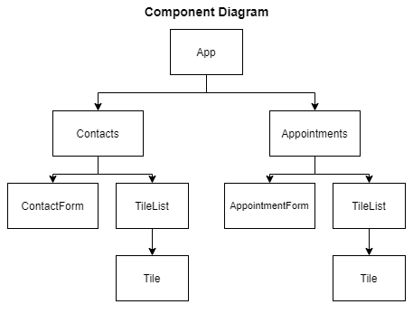

# Appointment Planner

In this project, I use functional React components to create an app that manages contacts and appointments. The app consists of two pages: one to view and add contacts and one to view and add appointments.

## About the Project

The app is built entirely with functional React components and relies on React hooks (`useState`, `useEffect`) for state management. Key features include:

- **Contacts page** — add new contacts with name, phone, and email. Duplicate names are detected in real time and blocked on submission.
- **Appointments page** — add appointments with a title, date, time, and a contact picked from the contacts list.
- Both pages display existing entries using a reusable `TileList` and `Tile` component.

## Component Structure


## Development Approach

This project was built using a test-driven workflow. Unit tests were generated with the help of an AI agent — [claude-instructions](https://github.com/wbern/claude-instructions) — which produced one failing test at a time following the Red phase of the Red-Green-Refactor cycle. Each test was then made green independently, without looking ahead, by writing only the minimal code needed to pass it.

This approach reinforced the discipline of writing focused, incremental implementations and helped build a solid understanding of how each component should behave before writing a single line of production code.

## Tech Stack

- React 18
- React Router v6
- React Testing Library
- Jest

## Getting Started

Install dependencies:

```bash
npm install
```

Run the app:

```bash
npm start
```

Run tests:

```bash
npm test
```
